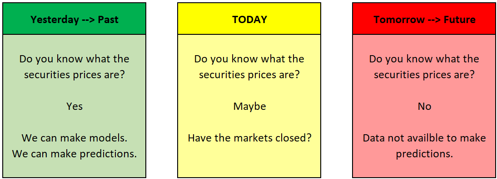
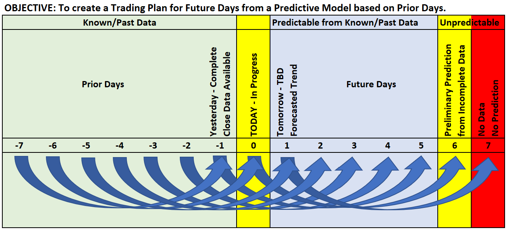
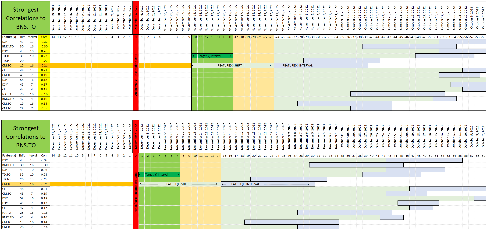
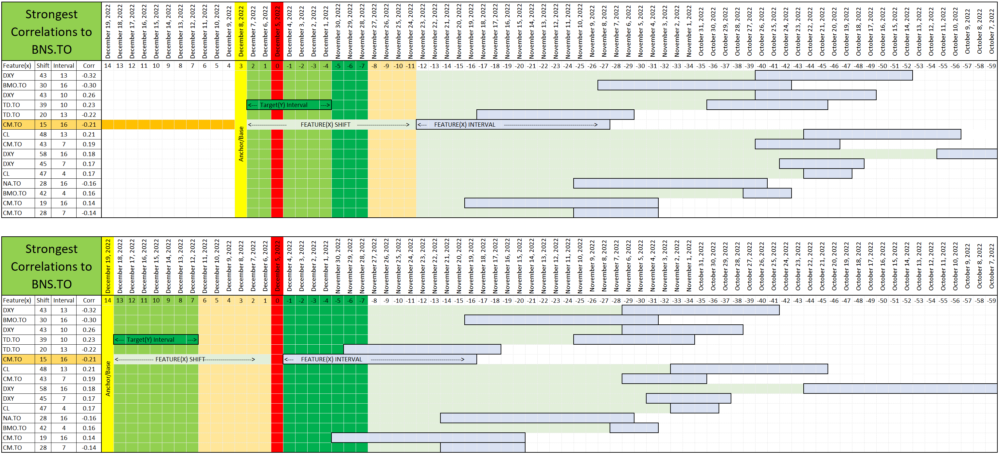
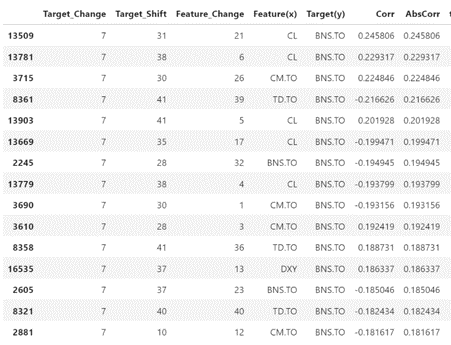
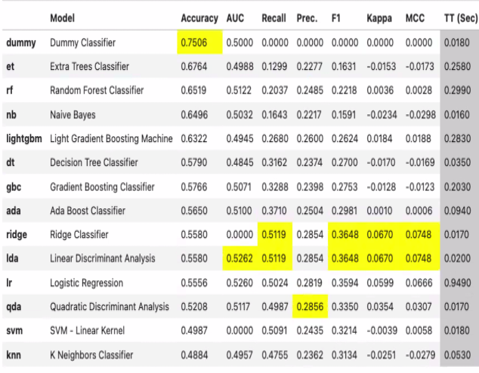

## Project 2 Overview

## Presentation Link & Google Colab Link

https://docs.google.com/presentation/d/1x6WQz60sm8E2nrq6oml_08uXx1_6KKVmHU9o3wt5lWs/edit?usp=sharing

https://colab.research.google.com/drive/1oMDA37RPqLsV02G0zDd6kaWDExMvUDVi

## Scope and Purpose of Project

For Project 2, the project team will be working off the findings in Project 1 (github link here: https://github.com/NatashaPredov/Project-1-.git) to further understand how the learnings from the last few Module's can work to benefit those applying them in real life situations. 

To summarize the scope from Project 1: 
- Wanted to investigate and determine a predictive model for the long term behaviour of relatively stable ETFs.
- Wanted understand how this model would react and change due to the unforseen impacts the COVID-19 pandemic had on the Canadian Banks. 
- The timeframe of the model data that the team will be analyzing covers 4 years: August 2016 through July 2020. While the validation data will cover: August 2019 through July 2020 - 6 months before and after the February 2020 COVID-19 crash. Due to this being unforseen and very out of the ordinary, the team will be ignoring the data up until Feb 2020 then picking our analysis back up 6 months post crash.

Now to extend from Project 1, Project 2's scope entails that the project team wanted to try to trade BNS in a way that would beat a buy and hold strategy relative to the other correlated bank stocks. The y variable, which is the target variable is the Bank of Nova Scotia stock otherwise represented henseforth as BNS. 

The baseline, that will represent the buy and hold strategy will come from the Monte Carlo simulation from BNS with its CI closer to the top end of CI. 

To ensure we meet the technical requirements of project 2, we will be using google colab (link: https://colab.research.google.com/drive/1oMDA37RPqLsV02G0zDd6kaWDExMvUDVi) to work in an Agile framework methedology to prepare a training and testing dataset. 

For this project we will be creating three machine learning models to fit and apply the data to, to determine which model returns the best trading performance. 

The timeline for this project covers: Aug 2017 - Aug 2022 per reccomendation for a 5 year period to ensure accurancy and industry standard. 

The three models are as follows:

Model 1: Machine Learning model using PyCaret

Model 2: Neural Network

Model 3: Moving Average Trading Indicators

## Analysis, Conclusions,  Implications and Connection to Course Content  
  
### Model 1: Machine Learning model using PyeCarrot
#### A.  Overview - Framord for Model Design  
   Supervised machine learning classification algorythm that predicts if a security is increasing or decreasing over a time period.
 * Modeling Data Availability: Consider when data is availible   

 *  Modeling Objective: Simple Model with Shift 
    1. Green: Data is availble to create models and predictions.
    2. Shift 6 days: Pridict up to 6 days in the future
    3. Yellow/Red: Data is not availble for modeling or predicting

 * Model Training Timeline: Complex Model with variable Shift and Interval
    1. Target (y variable) interval is 7 days
    2. Features (x variables) are sifted 14 to 58 days
    3. Features (x variables) intervals vary 4 to 16 Days
    4. Model is build from the past (Jan 1, 2014) to Present. Note: The ealiest possible target interval date is yesterday. 

 * Model Predicting Timeline: Complex Model with variable Shift and Interval
    1. First Prediction is for Day 0
    2. Minimum Feature(x) Shift (CM.TO = 15) is the maximum day of future predictions (days 0 to 14). 

  
#### B.  Variable Selection
   * Seeking Feature X to Target Y Correlation:
      * Target Y percent change over 7 days
         * Negative shift 8 - 42 days 
         * Avoids forward looking bias
      * Nested Loops for feature X variables
         * Percent change over 1 - 42 days 
      * Variable selection 
         * Highest correlation for each feature 
         * 13 total variables selected 
      * [Jupyter Notebook Output:](code/Project2_Correlations_to_BNS.ipynb)  

#### C. Trading Plan
It is important to have a trading plan describing when to enter and exit a trade.
   1. Predict a sequence of increases or decreases.
   2. Enter Trade: At the begining of the squence.  
      a.  Long (buy) up-trends  
      b.  Short (sell) down-trends  
   3. Exit Trade: With a trailing stop loss.  
      a.  1 Standard deviation of daily percent change in the opposit direction  
      b.  Emperical Rule: 84% of the daily changes will be in the correct direction.   

#### D.  Model Building with Pycaret
   * Data Selection 
      * Created data frames for Target Y and Feature X-variables 
      * Included shifts and percent change ranges 
      * Concatenated into single dataframe 
   * Using PyCaret Library
      * PyCaret recommends best machine learning option  
   * Logistic Regression Model. 
      * Imbalanced training dataset 920 : 307
      * Random Oversampler balanced to 520: 520
      * Balanced validation dataset 114 : 113
   * [Jupyter Notebook Output:](code/Project_2_ML_Logistic_Regression.ipynb)  

   
   * Training Model (Date Range Jan 1, 2014  -  Dec 31, 2018(5 years))
      * Train Test Split - 70 : 30
      * Training Accuracy Score  0.556
      * Testing Accuracy Score   0.573
      * Testing Precision Score(Increases)  0.75 
      * Testing Recall Score (Decreases) 0.40 
   * Model Validation (Date Range Jan 1, 2019  -  Dec 31, 2019(1 yr))
      * Testing Accuracy Score   0.502
      * Testing Precision Score(Increases)  0.50 
      * Testing Recall Score (Decreases) 0.00  
   
  
#### E. Conclusion
   * Training Model indicated correlation between leading and target stocks  
   * Validation Model failed in recommending a buying and hold strategy  
   * Next Steps  
      * Explore other models:  
         - Extra Trees Classifier (Highest Accuracy)  
         - Linear Discriminant Analysis (Highest AUC, Recall, and Precision)  
      * Develop more feature engineering variables:  
         - z-scores  
         - close as % of daily range  
         - 30 day rolling correlation  
  
  
### Model 2: Neural Network

At a highlevel, a neural network is a powerful machine learning algorithms that utilizes general approximation. What is so interesting about this type of algorithm is reflective of biological neural networks so it is inspired by the human brain. Simply put a neural network makes predictions by: 
- Taking in the input data which is the data from Project 1
- Making a prediction
- Comparing the predictions to the hypothesis
- Adjusting the state and functions within the network 

This algorithm was utilized in this project because what we have, and will continue to build, will be utilized by humans. So then, it was key to include a model that was inspired by the human brain and how humans make predictions and choices. This model allowed us to better understand how a human in this situation would react but with the ability to adjust the state and the functions within the network to produce a more accurate output. 

As the model is based on a deep learning neural network, it is designed to predict whether the stock of interest, BNS.TO will increase or decrease on a given day. The model predictions are valid for up to 15 trading days out, as the feature data lags the target by 15 days, up to 40 days previous. The model is given the percent changes and correlations of the several other financial stocks offset by 5 day increments. Then weights, optimizer, activations and loss function optimized on a validation set

Process: 
- We split the data into training, validation and test sets
- Training effects models weights, validation is used for tweaking, test ensures no overfitting
- We can plot the loss and accuracy as a function of the number of epochs
- We compare a single stock, BNS.TO to several other financial stocks via their delayed correlations
- We reduced the feature set using PCA before creating the neural network

Output:
- Generally, accuracy on the validation set will decrease pass a certain number of epochs due to overfitting
- Currently, the best weights give roughly 55% accuracy, with roughly 70% accuracy at predicting upward movement
- We can now test the model on real world data to compare the returns to a buy and hold strategy
- The models only predicts how the stock will move, but not by how much
- Neural network and PCA mean the model is a black box, so it unknown why it works
- Since the model can only reliably predict upwards movements, short selling is not a useful strategy
- Even so, the strategy noticeably out preforms the buy and hold strategy, not accounting for trading fees

This model directly relates to the course content as this was one of the models that was introduced in the course. Similarly to how in class, during this project we constantly extended off of previous knowledge leanred (ie reading in, cleaning data, outlining scope). 

## Model 3: Algorithmic Trading Models (EMA and DMA)
High Level Objective DMA - The goal was to create a optimizer to identify the optimum combination for the SMA windows used for the trading alogrithm to produce the highest cumulative return based on historical stock closing prices.

Process:

- Used yahoo finance API to source stock closing price information
- Stored closing price info into a dataframe
- Selected desired stock ticker from data frame (i.e. BNS.TO)
- Optimizer function uses the Dual Moving Average formula to determine which short term and long term values to apply to Simple Moving Averages algorithm to produce the highest cumulative return for the given period. 
 
 Output:
 
 - Dataframe output of displays the highest cumulative return along with the short term and long term variables used to produce the return
 - Dataframe was then sorted by descending order to easily identify which curves produced the best return for the given period
 
 The hope was the optimizer would identify the best short and long term windows to apply to the SMA curves, however it was revealed that different combinations were produced based on the historical closing prices.  Given more time, more work will be done on the optimizer to establish a prediction of what time windows to leverage for future use.
    
   Machine Learning Trading Bot - the goal was to find out the most appropriate entry(long) and  exit(short) position based on Ema 8 and ema 20 signals based on vwap for daily timeframe.
    
    Process:

- Used Alpaca API to source stock vwap price information;
- Stored VWAP price info into a dataframe;
- Selected desired stock ticker from data frame (i.e. BNS);
- Generate the short and long window for exponential moving average;
- Generate iterraws function to determine buy and sell signals;
- Split the data into training and testing datasets;
- Backtesting.
 
 Output:
 
 - The best weights give 69% accuracy at predicting upward movement and 80% downward movement 
 - This model can be tested on real world data to compare the returns to a buy and sell strategy

Based on this model we can get an idea when is the best time to buy and sell stocks.

 

## Areas of challenge

## Usage and Installation instructions

To view this project, follow the main branch found in this Github repo to the final code that encompasses all of the contributions made by the team members.

The code which is submitted is commented with concise, relevant notes that other developers can understand so future extensions on the work submitted can be explored if needed.

## Technical Requirements
The technical requirements for Project 2 are as follows:
- (DONE) Create a Jupyter Notebook, Google Colab Notebook, or Amazon SageMaker Notebook to prepare a training and testing dataset.
- Optionally, apply a dimensionality reduction technique to reduce the input features, or perform feature engineering to generate new features to train the model.
- Create one or more machine learning models.
- Fit the model(s) to the training data.
- Evaluate the trained model(s) using testing data. Include any calculations, metrics, or visualizations needed to evaluate the performance.
- Show the predictions using a sample of new data. Compare the predictions if more than one model is used.
- Save PNG images of your visualizations to distribute to the class and instructional team and for inclusion in your presentation and your repo's README.md file.
- Use one new machine learning library, machine learning model, or evaluation metric that hasn't been covered in class.

 Create a README.md in your repo with a write-up summarizing your project. Be sure to include any usage instructions to set up and use the model.
